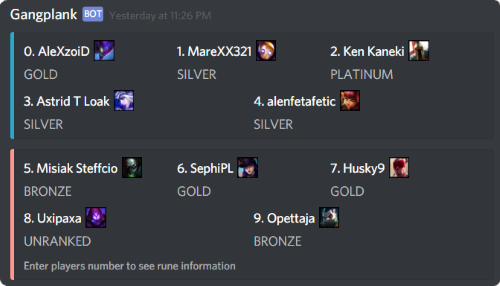

# GangplankBot - Riot Games API Challenge 2017

## EDIT: The results for the challenge: https://developer.riotgames.com/api-challenge-december2017.html

**YARRR!** This is a Discord bot for following League of Legends summoners game status. The main use case is: 
1. Add your summoner to be followed 
2. Join a game of League of Legends
3. Receive a message from Discord bot with your opponents rank 
4. Type the number of your opponent to Discord
5. Receive the list of runes your opponent is using for the game 
6. Plan accordingly and pwn!


## Main Features:
* Informs to a Discord channel when a player that is being followed joins a game
* Shows the ranks of all players in the game
* Shows the runes used by players
* Configurable list of summoners that are being followed

## Demo bot
* Runs with Riot API development key! Because of this, the bot will be offline for some time when this page is published. We will publish the real deal as soon as possible, so stay tuned!
* UPDATE: Now running with production key, be welcome to try the bot out!
* [Invite Gangplankbot](https://discordapp.com/api/oauth2/authorize?client_id=395219346030592001&permissions=2048&scope=bot) to your discord server
* Or join [GangplankBot server](https://discord.gg/4JKhnSs) and try it out!

## Commands
| Command | Usage | Description |
| ------- | ----- | ----------- |
| ?add [name] | ?add faker | Adds a summoner to the list of followed summoners. Gangplankbot will notify to your channel when the player joins a game. |
| ?remove [name] | ?remove faker | Removes the summoner from the list. |
| ?list | ?list | Lists the summoners that are being followed. |
| ?game [name]| ?game faker | Report current game information for the summoner. The summoner does not have to be on the list.|
| ?runes | ?runes | Toggle automatic runes reporting ON/OFF. **Warning**: Enabling this option causes quite a lot of spam! |
| ?runedesc [short/long]| ?runedesc short | Set short / long rune description |
| ?region [name]| ?region na | Sets the region used by the bot for the channel. **Warning**: This will clear the list of followed summoners. |
| ?joke | ?joke | Tells a pirate joke. **Yarrr!**|
| ?help | ?help | Shows help text. |
 

## Technical information
* Written in [Go](https://golang.org/)
    * Should work in Windows / Mac, but only tested in 64bit Linux (Ubuntu)
* Fetches data from [Riot API](https://developer.riotgames.com/) and DDragon
* Sends messages to [Discord](https://discordapp.com/), using [discordgo library](https://github.com/bwmarrin/discordgo)
* Data of bot's channels and their summoners is stored into [Google Cloud Firestore](https://firebase.google.com/)
* [Demo bot](https://discordapp.com/api/oauth2/authorize?client_id=395219346030592001&permissions=2048&scope=bot) runs in [Amazon Web Services](https://aws.amazon.com/) EC2 instance

## Installation
If you decide to run your own bot instead of using [ours](https://discordapp.com/api/oauth2/authorize?client_id=395219346030592001&permissions=2048&scope=bot), you may set it up by following these instructions. Unfortunately, because our project uses multiple different APIs, the installation part is a bit long. In the case there are problems, we suggest you first try to resolve the problem by checking the documentation, but feel free to drop a line to our discord [GangplankBot server](https://discord.gg/4JKhnSs) in case you need help.

### Install bot
* Get the code base into your Go environment (Go 1.8+ required) and build it
```
$ go get github.com/tahkapaa/gpbot
```
After this command, the executable can be run. The source will be in
```
$GOPATH/src/github.com/tahkapaa/gpbot
```

### Riot API
* Get Riot API key
    * Sign up at [https://developer.riotgames.com/](https://developer.riotgames.com/)
    * Generate API key (development key is ok for testing purposes).

### Discord
* Setup Discord Bot
    * Create an account to [Discord](https://discordapp.com/) if you do not have one already.
    * [Create a server](https://support.discordapp.com/hc/en-us/articles/204849977-How-do-I-create-a-server-) you want to use bot in
    * [Create a Bot and get a Token](https://github.com/reactiflux/discord-irc/wiki/Creating-a-discord-bot-&-getting-a-token) (Thanks for discord-irc project for the instructions!)
        * The bot needs "Send Messages" permission, others should be left unchecked
* Upload Emojis to Discord
    * The bot needs some images to be set up in discord. You will need multiple discord servers to have room for all the emojis that are needed, beacuse there is a limit of 50 emojis / server.
    * Download runesReforged.zip (sorry, no link) and unzip the contents
    * Download [Data Dragon assets](http://ddragon.leagueoflegends.com/cdn/dragontail-7.24.2.tgz) and unzip the contents
    * Add emojis to servers:
        * In Discord, select "Server Settings" -> "Emoji"
        * Select "Upload emoji"
        * Select files you want to upload
    * Upload all icons from runesReforged.zip
    * Upload champion icons from /dragontail-7.24.1/7.24.1/img/champion
        * The names of champions as emojis must be all lower case, i.e. "corki, ahri, leesin"
    * Add the IDs of the servers containing the emojis to the list in bot.go
```
// Server ids for emojis here
var emojiGuilds = []string{
	"server id 1",
}
```

### Google Cloud Firestore
* Setup Firestore
    * Go to [Cloud Firestore quickstart](https://firebase.google.com/docs/firestore/quickstart)
    * Create a Cloud Firestore project
    * Select "GO" from the instructions tab
    * Initialize Cloud Firestore (find the part with "on your own server")
        * The credentials JSON filename must be downloaded to the same directory as the gangplankbot executable and the name must be *fbaccountkey.json*

### Run the program
* Run the bot
```
$ ./gpbot -t <discord token> -a <Riot API key> -r na
```
* Check usage
```
$ ./gpbot --help
Usage of ./gangplankbot:
  -a string
    	Riot API key
  -r string
    	Default region to use (default "euw")
  -t string
    	Bot Token
```

## Final words
### Challenges
We chose to implement the bot with GO because our bot is doing concurrent work on the background, and because we knew the language pretty well. On the other hand, this caused a problem with using Riot API, because we could not find an open source client that had the features we wanted. In the end, we made the client by ourselves, and especially the rate limiting caused some headaches and it would still need some improvements. It would probably have been easier to add the missing cache support we needed to one of the open source solutions instead of doing our own (which still does not have a real cache).

One problem was that we thought showing images in discord messages was quite limited. For example, we thought that we would not be able to show rune images in our rune messages. After researching other Discord bots we figured out that it was possible to show emojis anywhere in the text and set custom pictures as emojis for Discord servers, with a limit of 50 emojis / server. Normally users are only allowed to use emojis of the user's current server in chats, but bots are one exception to this rule - they are allowed to use Emojis from all the servers they have been invited to. So now we have set up five Discord servers just to hold the images we need. To us this feels a bit hackish, but it works, so we use it.

### Lessons learned
Using the existing APIs and cloud services allowed a fast progress for us. For example, storing data to firestore, even though we had not used it before, took only a few hours, including setup and learning how to use it. And the best part is that now our data is stored so that we do not need to do the basic administrational tasks with the database.
Also, we probably should run the bot in AWS Elastic Beanstalk or some other more sophisticated service, because with EC2 we will probably end up spending quite a lot of time for administrative tasks that are really not so interesting.

Also it feels like using the AWS services allows the bot to perform faster. Running the bot in home desktop that is more powerful than the EC2 instance feels slower than the EC2 one. Maybe this is caused by faster http requests, because the server is closer to the API's that are used. But, this is just a feeling with no actual data to back it up.

### Incoming features
This kind of bot could do a lot more (and some of them do!), but there are a few things that we hoped to include but did not have the time.
* Proper cache for Riot API calls
    * We need a cache that could be configurable for each endpoint. For some endpoints it might be good to have a cache that refreshes every 30s, and some would be ok when refreshing once a day.
* Instead of typing the number for showing the runes, we could use discord reactions as a menu.
* Servers for holding emojis should be configurable (now they are hardcoded).
* Multiple minor improvements to be able to release the bot to production.

## Legal
GangplankBot is not endorsed by Riot Games and does not reflect the views or opinions of Riot Games or anyone officially involved in producing or managing League of Legends. League of Legends and Riot Games are trademarks or registered trademarks of Riot Games, Inc. League of Legends © Riot Games, Inc.
